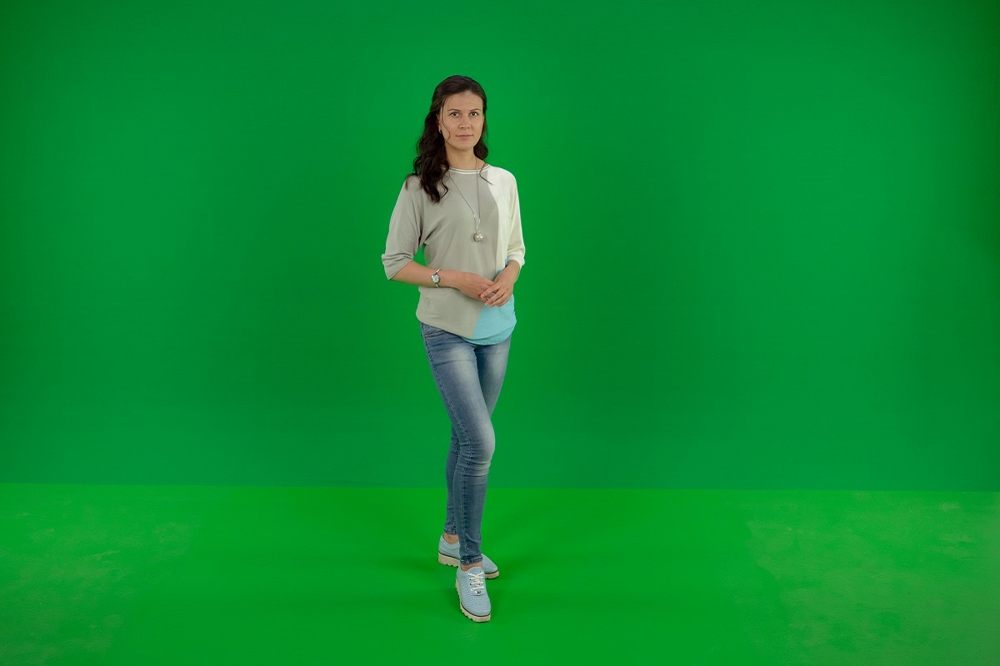
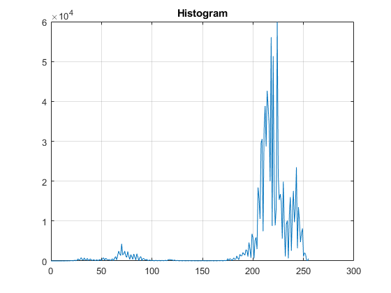

# Real-time chroma key filter
MATLAB implementation of fast and accurate chroma key filter based on histogram.  

## Introduction
[**Chroma key**](https://en.wikipedia.org/wiki/Chroma_key) compositing is a visual effects/post-production technique for compositing (layering) two images or video streams together based on colour hues (chroma range). The technique has been used in many fields to remove a background from the subject of a photo or video – particularly the newscasting, motion picture, and video game industries. A colour range in the foreground footage is made transparent, allowing separately filmed background footage or a static image to be inserted into the scene. The chroma keying technique is commonly used in video production and post-production.  
The aim of this code example is to extract the green background, also called chroma key, and replace it with the background from a different image. In fact what we're doing is keying out a black and white mask from the green component of the foreground image and using it to [**mask**](https://obsessive-coffee-disorder.com/chromakeying-in-matlab/).  

## MATLAB
Download [**matlab**](matlab) source folder and open **chromakey.m** file. Define script params and run.
```matlab
background = 'images/background/PANA0701_a.jpg'; % background image destination
foreground = 'images/foreground/PANA0701_b.jpg'; % foreground image destination
```
## Example
<p align="center"></p>  
<p align="center"><b>Figure 1.</b> Background and foreground images</p>  

<p align="center"></p>  
<p align="center"><b>Figure 2.</b> Histogram</p>  

<p align="center"></p>  
<p align="center"><b>Figure 3.</b> Blended image</p>  
